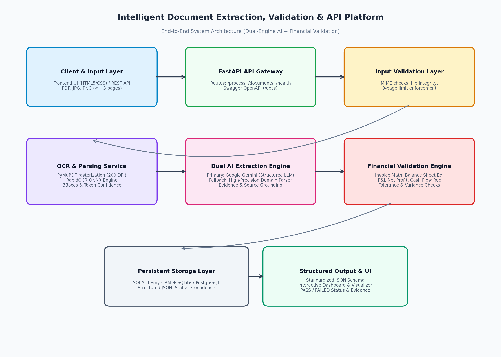

# FinEdge AI — Financial Document Intelligence Platform

An AI-powered document extraction, validation, and persistence platform for financial documents. FinEdge AI accepts invoices and financial statements in PDF, JPG/JPEG, and PNG formats, extracts structured information, performs financial consistency checks, stores processing results, and exposes them through a web dashboard and REST APIs.

> **Prototype:** Built as an AI Engineer Internship technical case-study solution, with emphasis on extraction accuracy, financial validation, modular engineering, deployment, and explainable processing.

---

## Links

**GitHub**
- Repository: https://github.com/Muskan-Gupta-tech/financial-document-ai
- Architecture: `docs/architecture.png`
- Solution Presentation: `docs/solution_presentation.pdf`

**Render**
- Live Application: https://financial-document-ai-noip.onrender.com
- Swagger / API Docs: https://financial-document-ai-noip.onrender.com/docs
- Health Check: https://financial-document-ai-noip.onrender.com/api/v1/health
- API Base URL: https://financial-document-ai-noip.onrender.com

---

## 1. Problem Statement

Financial-services teams frequently receive invoices and financial statements in native or scanned formats. Different document layouts, scan quality, OCR errors, and financial line items make manual extraction slow and inconsistent.

FinEdge AI provides an end-to-end workflow:

```
Document Upload
      ↓
File Validation
      ↓
Text Extraction / OCR
      ↓
Structured Field & Table Extraction
      ↓
Financial Validation
      ↓
Evidence & Confidence
      ↓
Database Persistence
      ↓
Dashboard + REST API
```

## 2. Supported Documents

The application supports the four document categories defined by the case study:

| Document Type | Examples of Extracted Information |
|---|---|
| Invoice | Invoice number, date, vendor, customer, currency, subtotal, tax, discount, total, line items |
| Balance Sheet | Statement information, periods, currency, assets, liabilities, equity and visible line items |
| Profit & Loss | Revenue, COGS/cost of sales, gross profit, operating expenses, operating profit, tax, net profit and visible line items |
| Cash Flow Statement | Operating, investing and financing cash flows, opening cash, net change and closing cash |

The system is designed specifically for these four assessment categories.

## 3. Input Requirements

Supported formats:

- PDF
- JPG / JPEG
- PNG

Documents are limited to 3 pages.

Before extraction, the application validates:

- File type
- File readability
- Empty files
- File integrity
- PDF page count
- Unsupported formats

Invalid documents are rejected with controlled API responses rather than exposing application stack traces.

## 4. Technology Stack

**Backend**
- Python 3.12
- FastAPI
- Pydantic
- SQLAlchemy
- SQLite
- PyMuPDF
- RapidOCR ONNX Runtime
- Google Gemini API
- Uvicorn

**Frontend**
- HTML
- CSS
- JavaScript
- Jinja2 templates

**Testing**
- pytest
- pytest-asyncio
- FastAPI TestClient

**Deployment**
- Render

## 5. Architecture

The complete architecture diagram is available here:



```
docs/architecture.png
```

**Processing Architecture**

```
                     ┌─────────────────────┐
                     │   Web Dashboard     │
                     │     HTML/CSS/JS     │
                     └──────────┬──────────┘
                                │
                                ▼
                     ┌─────────────────────┐
                     │    FastAPI API      │
                     │  Request Handling   │
                     └──────────┬──────────┘
                                │
                                ▼
                     ┌─────────────────────┐
                     │ Document Validation │
                     │ Type / Size / Pages │
                     └──────────┬──────────┘
                                │
                                ▼
                     ┌─────────────────────┐
                     │ OCR / Text Parsing  │
                     │ PyMuPDF + RapidOCR  │
                     └──────────┬──────────┘
                                │
                                ▼
                     ┌─────────────────────┐
                     │ Extraction Service  │
                     │ Deterministic First │
                     │ + Optional Gemini   │
                     └──────────┬──────────┘
                                │
                                ▼
                     ┌─────────────────────┐
                     │ Financial Validation│
                     │ Formula / Reconcile │
                     └──────────┬──────────┘
                                │
                                ▼
                     ┌─────────────────────┐
                     │ Evidence / Confidence│
                     └──────────┬──────────┘
                                │
                                ▼
                     ┌─────────────────────┐
                     │ SQLite Persistence  │
                     └──────────┬──────────┘
                                │
                     ┌──────────┴──────────┐
                     ▼                     ▼
              Dashboard Results       REST JSON API
```

## 6. OCR and Extraction

**Native PDF Documents**

PyMuPDF is used to extract native PDF text directly when sufficient text is available.

**Scanned PDFs and Images**

RapidOCR ONNX Runtime is used for:

- Scanned PDF pages
- JPG/JPEG documents
- PNG documents

OCR results include extracted text, confidence information, and page references where available.

**Extraction Strategy**

The primary extraction path is deterministic/domain-specific parsing.

This provides predictable extraction for the financial document formats in scope.

Google Gemini is used as an optional enrichment layer when configured and when fields remain missing after deterministic extraction.

Therefore:

```
Document
   ↓
OCR / Native Text
   ↓
Deterministic Extraction
   ↓
Missing Fields?
   ├── No → Continue
   └── Yes → Optional Gemini Enrichment
                  ↓
               Continue
```

Gemini is not required for the application to function. If the Gemini API is unavailable, rate-limited, or quota-exhausted, the deterministic extraction path continues.

## 7. OCR Memory Optimization

The deployed application runs on a resource-constrained Render environment, so OCR processing was optimized to reduce peak memory usage.

The implementation includes:

- Maximum OCR image dimension control
- Automatic downscaling of excessively large JPG/PNG images
- Dynamic PDF rendering DPI adjustment
- Release of rendered PDF image buffers after use
- Temporary OCR image cleanup
- Singleton RapidOCR engine initialization
- ONNX/BLAS thread-pool limits for small deployment instances

These optimizations allow large image uploads to be processed without unnecessarily retaining full-resolution image buffers.

## 8. Structured JSON Output

Processing results contain structured information including:

- document_name
- document_type
- file_validation
- extracted_data
- validation
- processing_metadata

Extracted information is represented using structured key-value objects and arrays for financial tables and invoice line items.

Where practical, extracted values include:

- Source/evidence text
- Page number
- OCR confidence

Missing or unreadable values are represented as `null` rather than being invented.

**Example**

```json
{
  "field": "total_amount",
  "value": 13125.0,
  "confidence": 0.97,
  "evidence": {
    "source_text": "Total Amount Due: USD 13,125.00",
    "page_number": 1
  }
}
```

## 9. Financial Validation

FinEdge AI performs deterministic financial consistency checks.

**Invoice**

Where information is available:

```
Quantity × Unit Price ≈ Line Total
```

Line-item totals are reconciled against reported subtotal/total values where applicable.

**Balance Sheet**

```
Assets = Liabilities + Equity
```

**Profit & Loss**

Relevant relationships are checked between:

```
Revenue
− Cost of Sales
= Gross Profit
```

and applicable operating expenses, taxes, and net profit.

**Cash Flow**

Relevant relationships include:

```
Opening Cash
+ Net Change in Cash
= Closing Cash
```

and:

```
Operating Cash Flow
+ Investing Cash Flow
+ Financing Cash Flow
= Net Change in Cash
```

Parenthesized financial values are interpreted as negative values where applicable.

Validation results are returned inside the structured JSON response with:

- Formula
- Operands
- Calculated value
- Reported value
- Variance
- Status
- Overall validation status
- Issues

## 10. Confidence and Evidence

Confidence scoring is derived from the document-processing pipeline, including OCR confidence where applicable.

Evidence/source information is retained to make important extracted values traceable to the original document.

Confidence values are not arbitrary LLM-generated scores.

## 11. Persistence

Processed documents are stored using:

- SQLAlchemy
- SQLite

The stored information includes:

- Document metadata
- Extracted results
- Validation results
- Processing metadata

The dashboard retrieves processed records from the persistence layer.

Documents can also be retrieved through the API using their document name.

For production workloads with concurrent users, PostgreSQL or another server-grade relational database would be preferable.

## 12. API

**Live API Base URL**

```
https://financial-document-ai-noip.onrender.com
```

**Health Check**

`GET /api/v1/health`

```
https://financial-document-ai-noip.onrender.com/api/v1/health
```

**Process Document**

`POST /api/v1/documents/process`

```bash
curl -X POST \
  "https://financial-document-ai-noip.onrender.com/api/v1/documents/process" \
  -F "file=@sample_invoice.jpg" \
  -F "document_type=invoice"
```

**Get Document**

`GET /api/v1/documents/{document_name}`

```bash
curl "https://financial-document-ai-noip.onrender.com/api/v1/documents/sample_invoice.jpg"
```

**List Processed Documents**

`GET /api/v1/documents`

```bash
curl "https://financial-document-ai-noip.onrender.com/api/v1/documents"
```

**Swagger / OpenAPI**

Interactive API documentation is available at:

```
https://financial-document-ai-noip.onrender.com/docs
```

## 13. Deployment

The application is deployed using Render.

**Live Application**
```
https://financial-document-ai-noip.onrender.com
```

**API Documentation**
```
https://financial-document-ai-noip.onrender.com/docs
```

**Health Check**
```
https://financial-document-ai-noip.onrender.com/api/v1/health
```

**API Base URL**
```
https://financial-document-ai-noip.onrender.com
```

## 14. Testing

The current automated test suite contains 20 passing tests.

```
20 passed
```

Coverage includes:

- Health API
- Invoice processing API
- Document retrieval API
- Document listing API
- Dashboard routes
- Unsupported file validation
- Empty file validation
- PDF page-limit validation
- Invoice extraction
- Balance Sheet extraction
- Profit & Loss extraction
- Cash Flow extraction
- Invoice financial validation
- Financial validation failure
- Balance Sheet equation validation
- Cash Flow reconciliation
- Parentheses/negative-value handling

The application was also manually tested locally using the sample invoice JPG.

The deployed Render application was subsequently tested with the JPG processing flow after the OCR memory optimization.

## 15. Repository Structure

```
financial-document-ai/
│
├── backend/
│   ├── app/
│   │   ├── api/
│   │   │   └── routes/
│   │   ├── core/
│   │   ├── models/
│   │   ├── repositories/
│   │   ├── schemas/
│   │   ├── services/
│   │   │   ├── document_service.py
│   │   │   ├── document_validation_service.py
│   │   │   ├── extraction_service.py
│   │   │   ├── financial_validation_service.py
│   │   │   └── ocr_service.py
│   │   └── utils/
│   │
│   ├── tests/
│   │   ├── test_api.py
│   │   ├── test_extraction.py
│   │   └── test_validation.py
│   │
│   └── requirements.txt
│
├── frontend/
│   ├── templates/
│   └── static/
│
├── data/
│   └── sample_documents/
│
├── docs/
│   ├── architecture.png
│   └── solution_presentation.pdf
│
├── sample_outputs/
│   └── *.json
│
├── .env.example
├── .gitignore
├── Dockerfile
├── render.yaml
├── requirements.txt
└── README.md
```

## 16. Sample Outputs

Sample structured JSON results are available in:

```
sample_outputs/
```

They demonstrate extraction and financial validation results for the supported document types and validation scenarios.

## 17. Presentation

The solution presentation is available at:

```
docs/solution_presentation.pdf
```

The architecture diagram is available at:

```
docs/architecture.png
```

## 18. Configuration and Security

Configuration is provided through environment variables.

Example configuration is available in:

```
.env.example
```

Sensitive credentials such as API keys are not committed to the repository.

The actual `.env` file is excluded through `.gitignore`.

Relevant environment variables include:

- DATABASE_URL
- UPLOAD_DIR
- GEMINI_API_KEY
- GOOGLE_API_KEY
- LLM_MODEL
- ENVIRONMENT

## 19. Known Limitations

This is a technical-case-study prototype rather than a production enterprise document platform.

Known limitations include:

- OCR accuracy depends on document quality, image resolution, orientation, and layout.
- Complex or highly unusual financial layouts may require additional extraction logic.
- Gemini enrichment depends on API availability and applicable free-tier quotas/rate limits.
- SQLite is appropriate for this prototype but is not ideal for high-concurrency production workloads.
- Render free-tier CPU and memory resources limit throughput and concurrent processing.
- The system currently focuses on the four financial document categories required by the assessment.
- Automated document-type classification is not required and is therefore not implemented as a mandatory processing step.

## 20. Production Improvements

For a production deployment, the following improvements would be considered:

**Infrastructure**
- PostgreSQL instead of SQLite
- Object storage such as S3-compatible storage for uploaded documents
- Background/asynchronous document processing
- Queue-based processing architecture
- Horizontal scaling
- Dedicated OCR/document-processing workers

**AI / Extraction**
- Layout-aware document models
- Improved table extraction
- Model ensembles for difficult documents
- Larger evaluation datasets
- Automated extraction accuracy benchmarking
- Human-in-the-loop review for low-confidence results

**Security**
- Authentication and authorization
- API rate limiting
- Secure document storage
- Encryption at rest and in transit
- Stronger upload sandboxing
- Audit trails

**Observability**
- Application metrics
- Distributed tracing
- Error monitoring
- OCR/LLM latency monitoring
- Extraction-quality monitoring
- Production alerting

## 21. AI-Assisted Development Declaration

Generative AI development tools were used during the implementation of this project, including ChatGPT and Claude, for activities such as:

- Software architecture discussion
- Implementation assistance
- Debugging
- Refactoring
- Test development
- Documentation
- Deployment troubleshooting
- Code review and optimization suggestions

The candidate remains responsible for the submitted implementation. The application was locally tested, automated tests were executed, deployment issues were diagnosed, and the deployed application was manually verified.

The assessment permits the use of generative AI assistants and focuses on the candidate's ability to understand, explain, debug, and modify the submitted solution.

## 22. Case Study Completion Checklist

- [x] Public GitHub repository
- [x] Live frontend
- [x] Live backend API
- [x] Swagger/OpenAPI documentation
- [x] Health endpoint
- [x] PDF/JPG/PNG support
- [x] Maximum 3-page validation
- [x] Invoice extraction
- [x] Balance Sheet extraction
- [x] Profit & Loss extraction
- [x] Cash Flow extraction
- [x] Scanned/image OCR
- [x] Structured JSON output
- [x] Financial validation
- [x] Evidence/confidence information
- [x] Database persistence
- [x] Document retrieval
- [x] Processed-document dashboard
- [x] Raw JSON view
- [x] Automated tests — 20 passing
- [x] Architecture diagram
- [x] Sample JSON outputs
- [x] Solution presentation
- [x] AI usage declaration
- [x] Known limitations
- [x] Production improvement notes
- [x] No secrets committed to GitHub

## 23. Final Objective

FinEdge AI demonstrates a complete document-intelligence workflow:

```
Upload
  ↓
Validate
  ↓
OCR / Text Extraction
  ↓
Structured Financial Extraction
  ↓
Optional AI Enrichment
  ↓
Financial Validation
  ↓
Evidence + Confidence
  ↓
Persist
  ↓
REST API + Dashboard
```

The implementation is intentionally scoped as a practical, testable, and deployable prototype for the financial document intelligence case study rather than as a full production enterprise platform.
